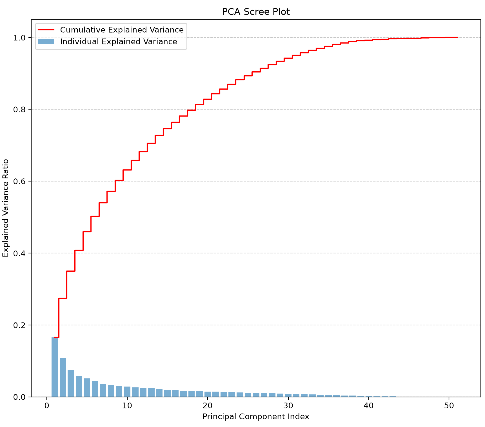

# Next "Player X"

## Overview

This project aims to identify affordable, young players who are statistically similar to a player of the user's
choosing. This is useful in the scenario where a club is looking to replace a departing player who was very good. During
the making of this I used Rodri and Van Dijk as example players who might need replacing in the near future. Rodri has
since left Manchester City.

## Data Collection and Transformation

The programme works by collecting data of players from the top 5 leagues over the last 4 seasons who have made at least
10 appearances in one season, and are capable of playing the same position as the target player. This data is collected
from SofaScore using their web API alongside the player's age and market value. All the data points which are volume
metrics (vs rate metrics) are transformed into per 90 terms so that there is consistency across players with different
playing time. The data is then written to a JSON file where each entry represents a player's season statistics.

Historical team possession data is then used to normalise the statistics of each player to account for the differences
in tactical approaches between teams. Only the statistical categories that have some weak correlation (R² > 0.1) with
possession are normalised, and this is done per position. For example, for strikers, goals per 90 is correlated with
possession, but this isn't the case for central midfielders.

All statistical categories are then converted into percentiles, so each stat category represents "This player's
statistic X is higher than Y% of players who can play Z position."

## Principal Component Analysis (PCA)

There are a total of 51 match stat categories collected from SofaScore, and many of these are highly correlated with
each other. To reduce the dimensionality of the data, PCA is used to transform the data into a smaller number of
uncorrelated variables called principal components. The first 5 principal components were chosen as they explain roughly
45% of the variance in the data. This is shown in the diagram below:



One thing to note is that this diagram varies ever so slightly based on the position of the target player, because when
a player is chosen, just that position's dataset is selected. However in all cases, 5 PCs explain a similar amount of
variance.

## Squared Distancing

Now that the data has been transformed, a column is created in the dataframe which represents the squared distance
between each player and the target player. This is done by taking the difference between each player's principal
component values and the target player's principal component values, squaring those differences, and summing them up.
The players are then sorted by this squared distance, with the smallest distances indicating players who are most
similar to the target player.

There are various input variables that the user can tailor to their needs, such as the maximum age of the player, and
the maximum market value of the player. This allows the user to find players who are not only similar to the target
player, but also fit within their budget and age requirements. Another input the user can alter is the time period over
which the target player's statistics are taken. For example, you could say that you want a player who has just had a
season similar to Rodri's ballon d'or winning season specifically.

## Example Usage

Below is the top 6 closest players to Rodri's 23/24 season, with a maximum age of 24 and a maximum market value of €50m:

```
                             PC1       PC2     PC3       PC4       PC5
Rodri @ Man City 23/24  1.102309  1.064036  0.0572  1.446972  0.296985
                                        currentAge  marketValue  targetDistance   PC1   PC2   PC3   PC4   PC5
Mamadou Sangare @ Lens 25/26                  24.0   39000000.0        0.706909  1.00  0.62  0.72  1.20  0.34
Lamine Camara @ AS Monaco 25/26               22.0   41000000.0        0.935757  1.38  0.77  0.62  0.82  0.04
Valentín Barco @ Strasbourg 25/26             22.0   44000000.0        1.187040  1.37  0.90  0.33  0.44  0.26
Pape Diop @ Toulouse 25/26                    22.0    8199999.0        1.723477  0.94  1.04  0.34  0.20  0.51
Emirhan İlkhan @ Torino 25/26                 22.0    6300000.0        1.848567  0.24  0.53 -0.00  0.54  0.24
Arthur Avom Ebong @ Lorient 25/26             21.0   19400000.0        1.879152  0.74  1.36  0.48  0.24  0.12
```

Something which interests me is that the top 3 players were all involved in transfers this summer, specifically from
Premier League clubs. Mamadou Sangare has signed for Brentford and has been one of the signings of the season (as of
October 2026), Lamine Camara was minutes away from signing for Chelsea to fill an Enzo Fernández shaped hole in their
midfield before Monaco pulled the plug, and Valentín Barco was signed by Chelsea from sister club Strasbourg. To me this
is an indication that the model is working well, as it is identifying players who are being scouted and signed by top
clubs.

Another thing that I noticed is that 5 out of the 6 players are from Ligue 1. A possible explanation for this is that
Ligue 1, like the Premier League, is a very physical, fast-paced, transitional league, and so it's more likely that
players are statistically similar to target players selected from the Premier League. Another thing this could indicate
is that Ligue 1 is a good place to look for undervalues youngsters who could quickly adapt to Premier League football.

The next example uses Van Dijk as the target player. Unlike Rodri, who has had some pretty injury-filled seasons, Van
Dijk has been very consistent over the last 4 seasons. This means that we can run the model without picking a specific
season, and the programme will compare players to Van Dijk's average principal component values over the last 4 seasons.
Below is the output from doing this, with the same age and market value limits as the earlier example:

```
                                        PC1       PC2       PC3       PC4       PC5
Virgil van Dijk @ Liverpool 25/26 -0.651466  1.753288  0.479015  0.462065  0.300435
Virgil van Dijk @ Liverpool 24/25 -0.546950  1.482021  1.253662  0.257109  0.318038
Virgil van Dijk @ Liverpool 23/24 -0.555010  1.376829  0.775997  0.343815  0.872256
Virgil van Dijk @ Liverpool 22/23 -0.942080  1.587935  0.631857  0.419388  0.733042
                                            currentAge  marketValue  targetDistance   PC1   PC2   PC3   PC4   PC5
Tarik Muharemović @ Sassuolo 25/26                23.0   27000000.0        0.553000 -0.55  0.95  0.40  0.36  0.38
Charlie Cresswell @ Toulouse 25/26                24.0   24000000.0        0.654558 -0.25  1.40  0.30  0.19  0.12
Alan Matturro @ Levante 25/26                     21.0    4099999.0        1.359575  0.10  1.14  0.19 -0.10  0.48
Chrislain Matsima @ Augsburg 25/26                24.0   21000000.0        1.621615 -0.51  0.63  0.36 -0.37  0.40
Marc Pubill @ Atl. Madrid 25/26                   23.0   33000000.0        1.728919  0.22  1.11  0.04  0.16  0.18
Konstantinos Koulierakis @ Wolfsburg 25/26        22.0   24000000.0        2.156665  0.66  1.51  0.86  0.03  0.05
```

This group of players displays the same trend as the Rodri example, with 4 out of the 6 players having moved club this
summer: Muharemović has moved to Leeds and has played every minute in statistically the best defence in the Premier
League so far, Cresswell has stayed in Ligue 1 but has moved to Rennes, Matturro has moved to Shakhtar Donetsk, and
finally Koulierakis has moved to Roma.

The main difference between the two examples is that previously we saw primarily Ligue 1 players being scouted by
Premier League sides, whereas now there is much more variation in terms of leagues and destination clubs. This could be
because the skills required to be a top centre back are more universal across different leagues than those required to
be a defensive midfielder in the Premier League.

